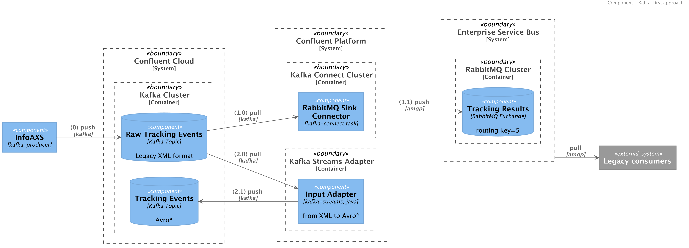
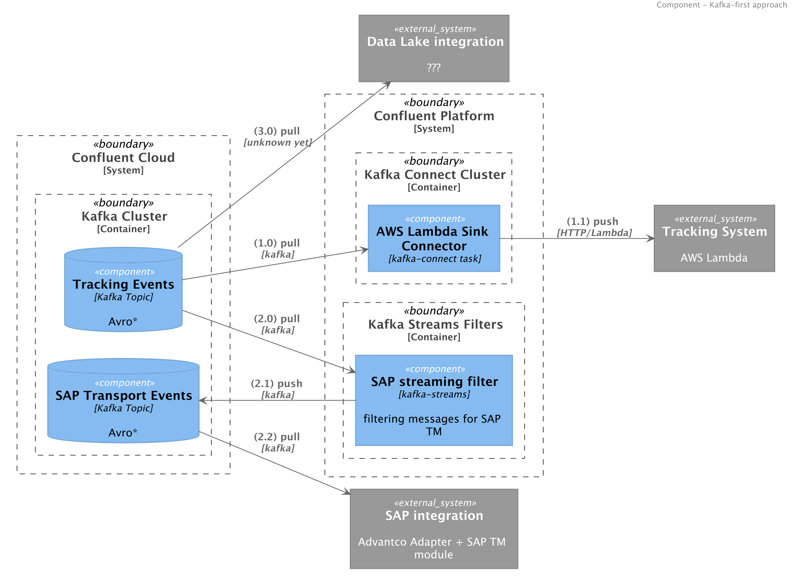
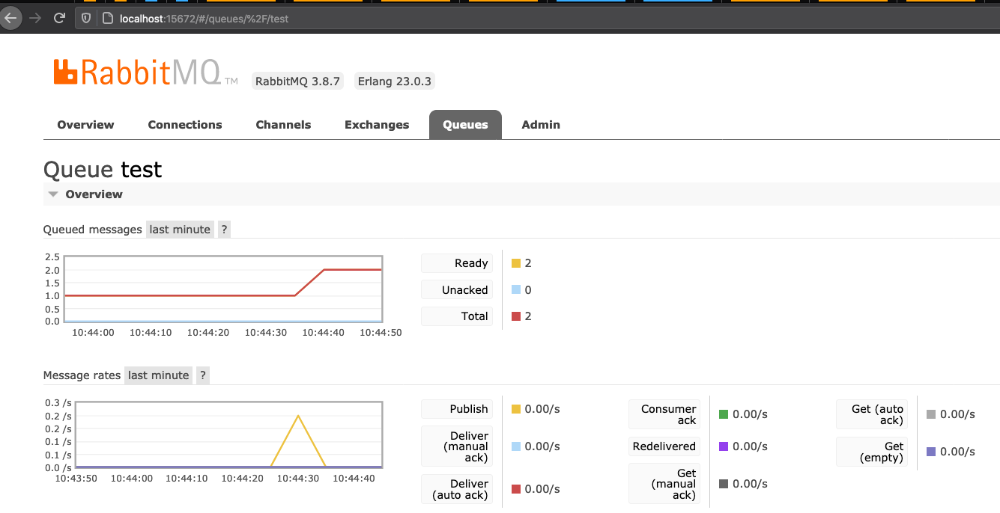
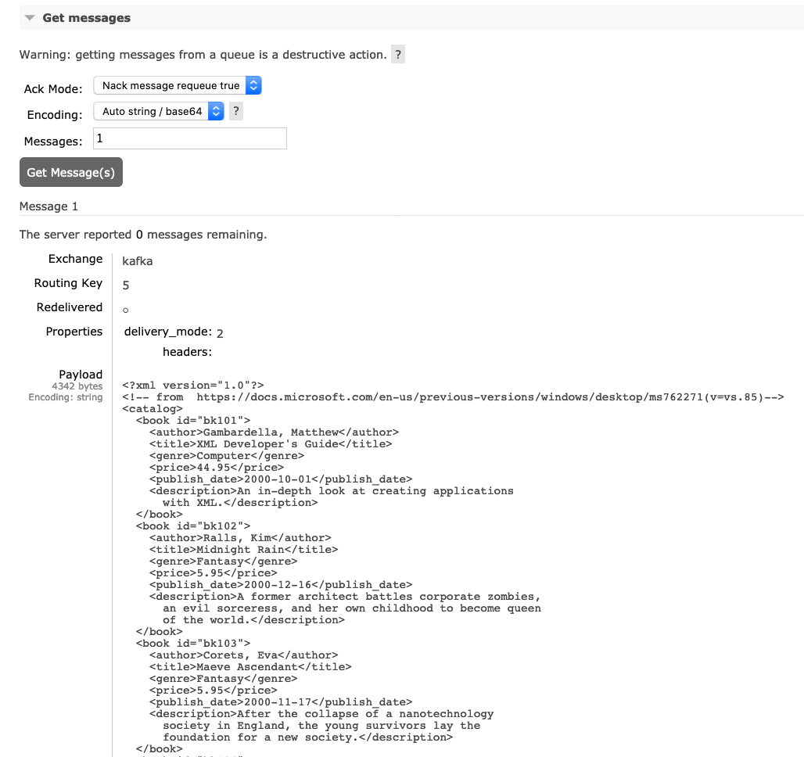
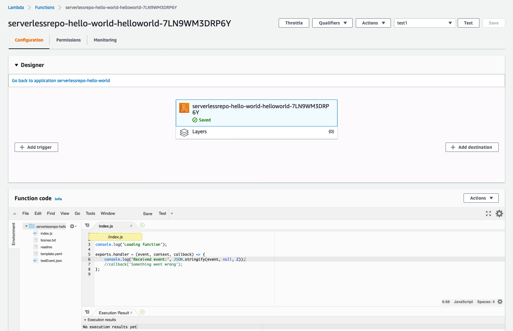
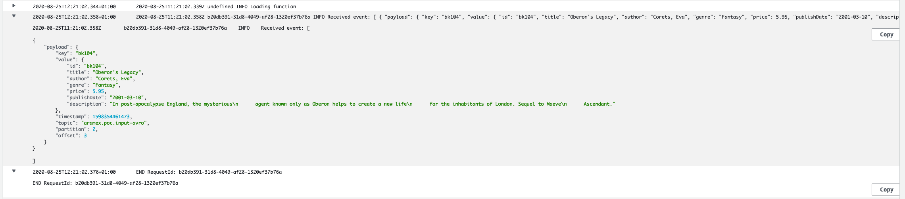
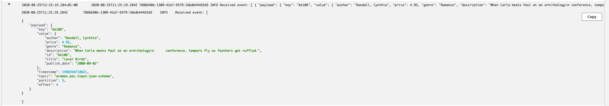
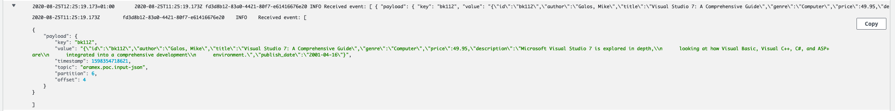
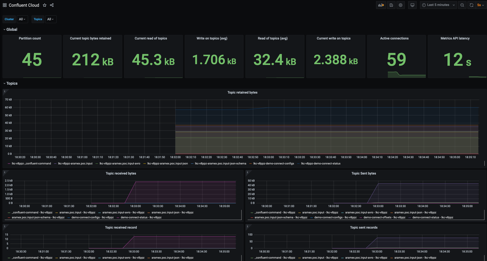

# Proof of Concepts - Aramex

* Topology Builder to manage Topics and ACLs
* Kafka to RabbitMQ
* Transforming XML payload to schema-based formats
* Kafka to AWS Lambda

## Architecture





## How to run

### Local deployment

Required software:

* IDE (e.g. Intellij)
* JDK 14
* Docker, Docker Compose
* Make

0. Download Kafka Connectors into `connector-plugins`:

```shell script
make connector-download
```

or go to [Confluent Hub](https://hub.confluent.io) to download connectors manually.

1. Start [Docker Compose](local.yml)

```shell script
make local-up
```

2. Create topics with [Kafka Topology Builder] ([topology](./topologies/local.yml))

```shell script
make local-topology
```

3. Create RabbitMQ exchange, queue, and binding:

```shell script
make rabbitmq
```

4. Deploy Kafka Connector RabbitMQ Sink:

```shell script
make connector-rabbitmq
```

5. Produce some data running a Kafka producer: 

```shell script
make local-producer
```

6. Check events are found in RabbitMQ. Go to RabbitMQ Console and get messages from test queue:





7. To continue with the data flow, start streams application to translate XML into schema-based formats:

```shell script
make local-streams
```

8. Deploy a lambda function that prints out incoming payload:

> using Hello world template



9. Deploy connectors to AWS Lambda to consume Avro, plain JSON, and JSON Schema based messages in a AWS Lambda function: 

```shell script
make connectors-awslambda
```

10. Check that messages are logged, and validate payloads:







To produce more input events:

```shell script
make local-producer
```

### Confluent Cloud

#### Credentials

Create an `env` file ([template](./env.template)) with the Confluent Cloud IDs and API Keys:

- Get Environment ID and Kafka Cluster ID via http://confluent.cloud or CLI:

```shell script
ccloud environment list
ccloud kafka cluster list
```

and set values on `env` file.

Then describe your Kafka cluster to get the bootstrap servers URL:

```shell script
ccloud kafka cluster describe ${CCLOUD_CLUSTER}
```

Similarly, enable Schema Registry in your environment, and get the details:

```shell script
ccloud schema-registry cluster describe
```

Once IDs are defined, create API Keys:

1. Create API Keys for Topology Builder:

```shell script
make ccloud-topologybuilder-api-keys
```

and set values in [config file](./topologies/ccloud.properties) ([template](./topologies/ccloud.properties.template))

2. Create API Keys for CCloud Exporter (Monitoring):

```shell script
make ccloud-exporter-api-keys
```

and set values on `env` file.

3. Create API Keys for Kafka Connect:

```shell script
make ccloud-connect-api-keys
```

and set values on `env` file.

4. Create API Keys for Applications:

Create Service Account:

```shell script
make ccloud-app-service-account
```

and save ID on `env` file.

Create ACLs for Service Account:

```shell script
make ccloud-app-acl
```

and finally create API Keys for the applications:

```shell script
make ccloud-app-api-key
```

and set values on `env` file.

#### Run Demo

1. Start [Docker Compose](./ccloud.yml)

```shell script
make ccloud-up
```

2. Create topics with Topology Builder ([topology](./topologies/ccloud.yml))

```shell script
make ccloud-topology
```

3. Prepare RabbitMQ with exchange and queue:

```shell script
make rabbitmq
```

4. Deploy RabbitMQ connector:

```shell script
make ccloud-connector-rabbitmq
```

5. Deploy Kafka Streams application to process raw XMLs:

```shell script
make ccloud-streams
```

6. Deploy Kafka Connectors for AWS Lambda:

```shell script
make ccloud-connector-awslambda
```

Finally, to monitor CCloud Cluster: go to Grafana <http://localhost:3000> and check metrics:



## References

* Topology Builder support for CCloud: <https://github.com/purbon/kafka-topology-builder/issues/10>