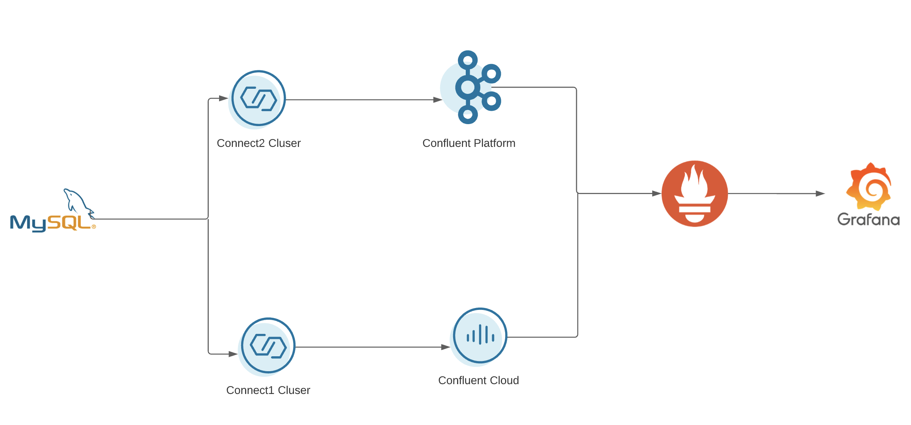
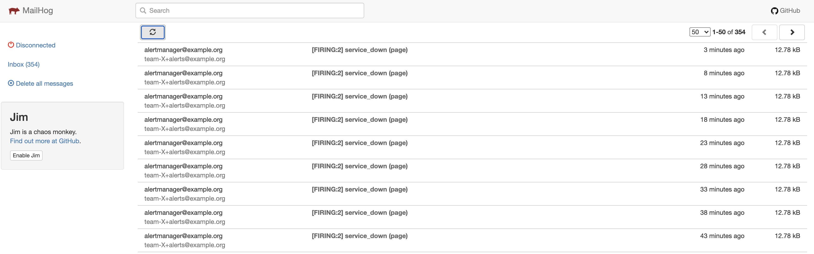

# Kafka Connect Monitoring Sandbox


The purpose of this repository is to provide a quick bootstrap way to set up Kafka Connect with Confluent Platform and Confluent Cloud. In addition, it offers monitoring services through Prometheus and Grafana for both Confluent Platform components and Confluent Cloud. You can also configure alerting for your sandbox through AlertManager to test out a fully functional alerts. 

## Architecture


## Sandbox Setup

Required software:

* IDE (e.g. Intellij)
* JDK 11
* Docker, Docker Compose
* Make

A. Download Kafka Connectors into `connector-plugins`: 

```shell script
make connector-download
```

or go to [Confluent Hub](https://hub.confluent.io) to download connectors manually.


### Confluent Cloud

#### Credentials

A. Create an `env` file ([template](./env.template)) with the Confluent Cloud IDs and API Keys:

- Get Environment ID and Kafka Cluster ID via http://confluent.cloud or CLI:

```shell script
confluent login 
confluent environment list
confluent kafka cluster list
```

and set `CCLOUD_ENV` & `CCLOUD_CLUSTER` values in the `env` file.

B. Then describe your Kafka cluster to get the bootstrap servers URL:

```shell script
confluent kafka cluster describe ${CCLOUD_CLUSTER}
```

C. Similarly, enable Schema Registry in your environment, and get the details:

```shell script
confluent schema-registry cluster describe
```
and set `CCLOUD_SR` & `CCLOUD_SR_URL` values in the `env` file.

D. Once IDs are defined, create API Keys:

 Create API Keys for CCloud Exporter (Monitoring):

```shell script
make ccloud-exporter-api-keys
```

and set `CCLOUD_EXPORTER_API_KEY` & `CCLOUD_EXPORTER_API_SECRET` values in the `env` file.

 Create API Keys for Kafka Connect:

```shell script
make ccloud-connect-api-keys
```

and set `CCLOUD_CONNECT_API_KEY` &`CCLOUD_CONNECT_API_SECRET` values in the `env` file.

and set values on `env` file.

 Create API Keys for Applications:

Create Service Account:

```shell script
make ccloud-app-service-account
```

and save ID as `CCLOUD_SERVICE_ACCOUNT` in the `env` file.

E. Create ACLs for Service Account:

```shell script
make ccloud-app-acl
```

and finally create API Keys for the applications:

```shell script
make ccloud-app-api-key
```

and set values on `CCLOUD_API_KEY` & `CCLOUD_API_SECRET` `env` file.

#### Run Self-Managed Connectors to Confluent Cloud

G. You can create topics with the Confluent CLI:
```shell script
make ccloud-topic
```

H. Start [Docker Compose](docker-compose.yml)

Verify that you have the env var $CP_VERSION set to the preferred CP version first.

```shell script
make up
```


I. Deploy Datagen Connectors:

```shell script
make ccloud-datagen-users
```

```shell script
make ccloud-datagen-users-schema
```
J. Deploy MYSQL JDBC Connectors:
```shell script
make ccloud-jdbc-bulk-mode-source
```

```shell script
make ccloud-jdbc-incremental-mode-source
```

```shell script
make ccloud-jdbc-timestamp-mode-source
```

```shell script
make ccloud-jdbc-timestamp-mode-source
```

Finally, to monitor CCloud Cluster: go to Grafana <http://localhost:3000> and check metrics:


### Local Confluent Platform deployment


 
A. You can create topics with the kafka-utility command line:
```shell script
make local-topic
```

B. Deploy one of the Datagen connectors: 

```shell script
make local-datagen-commercials
```
```shell script
make local-datagen-inventory
```

C. Deploy MySQL JDBC connectors:
```shell script
make local-jdbc-mysql
```
```shell script
make local-jdbc-mysql-custom-query
```
```shell script
make local-jdbc-sink
```


## Monitoring & Alerting

You can view the connector metrics and Kafka broker metrics on Grafana

Visit http://localhost:3000/

* Username: `admin`
* Password: `admin`

Go to the Kafka Connect dashboard to see the connector metrics


To configure alerting, visit the alertmanager directory under the root directory of this project. One can set up the SMTP server in `alertmanager.yml`. Currently, mailhog is the SMTP server that alertmanager is using for notifications. 

Custom alerts can be added in PromQL format to the `alertrules.yml` file in the alertmanager directory. Can visit the alerts in the UI at <http://localhost:9093>


Prometheus has alertmanager set up as its alerting target. Any metrics that have an alert threshold applied to it, will trigger an alert if that threshold is crossed and send it out to the alert notifications.

Alert notifications can be found in the mailhog UI at <http://localhost:8025>



## How to Add Connectors
If you want to add a connector to this sandbox to test it out and see how it can be monitored, you can do so by doing the following.

- If the desired connector's plugin does not come with the Kafka Connect cluster, download and install the jar in the `connector-plugins/` folder.

- Once the plugin has been added, create the connector config file and place it in either the `ccloud` or `local` directory depending on which cluster you want to read/write the data to.

- Deploy the newly added connector. Feel free to add the curl command to the Makefile to easily resuse it for the future.


## References

* For a quick reference on what connector-configs should look like, visit the [examples](https://github.com/confluentinc/kafka-docker-playground/tree/master/connect) github repo. Here you can find examples of almost all the open source supported connect configs. 
